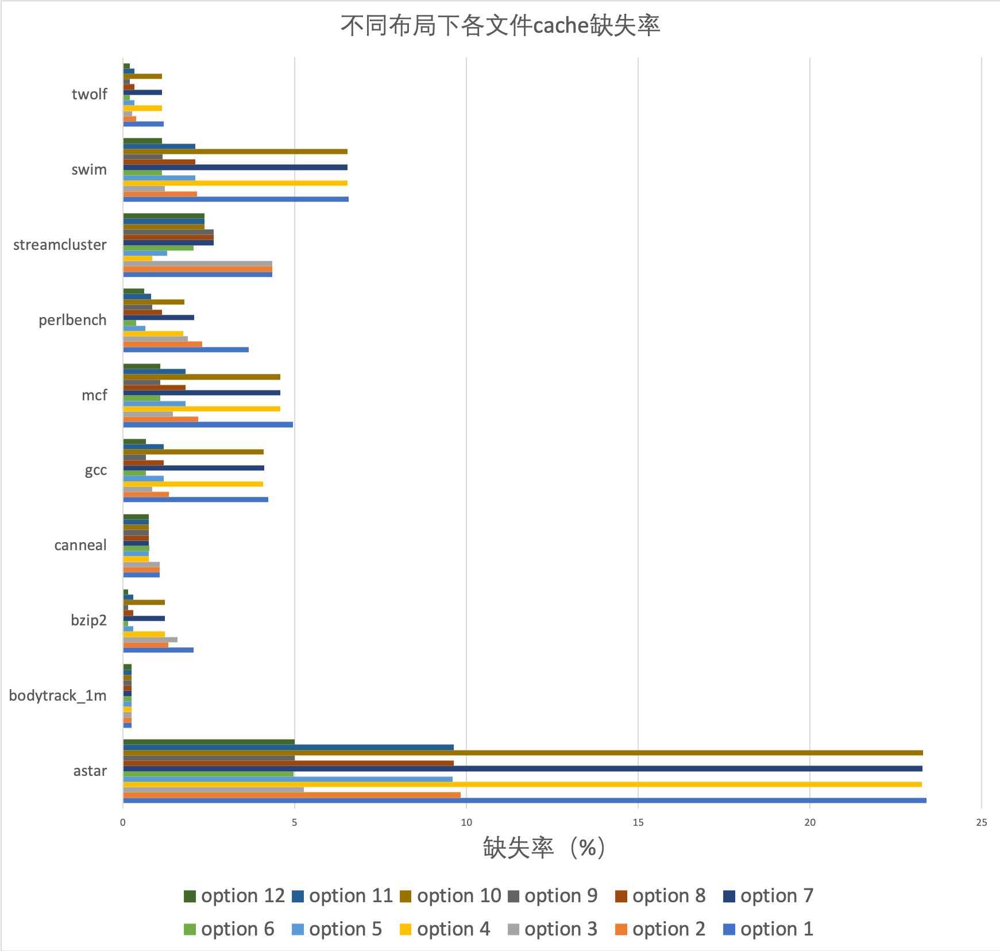
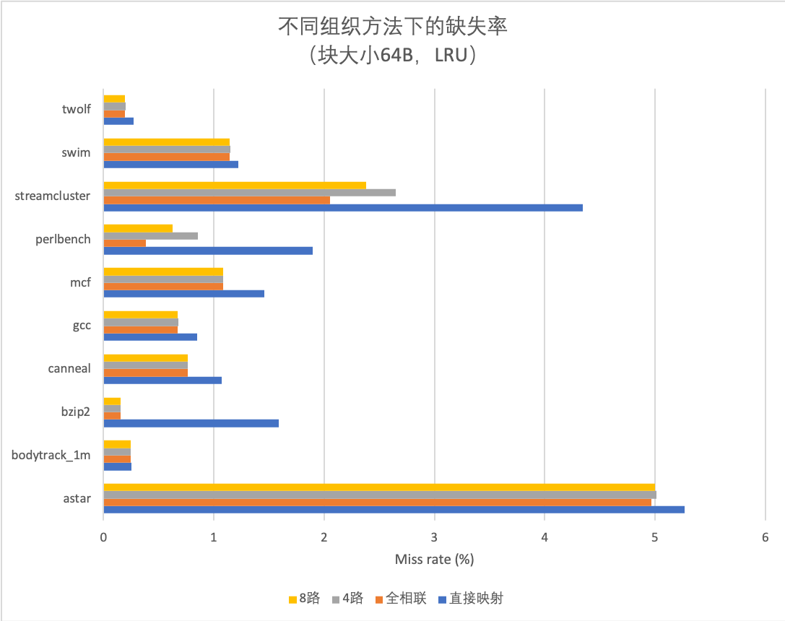
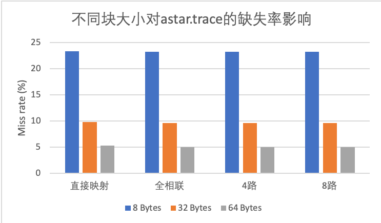
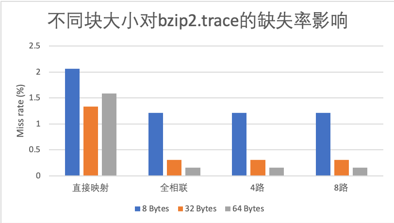
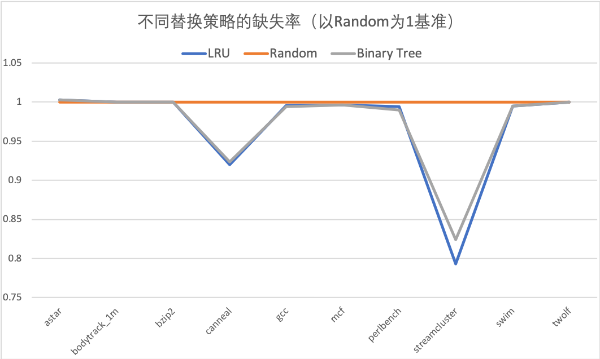
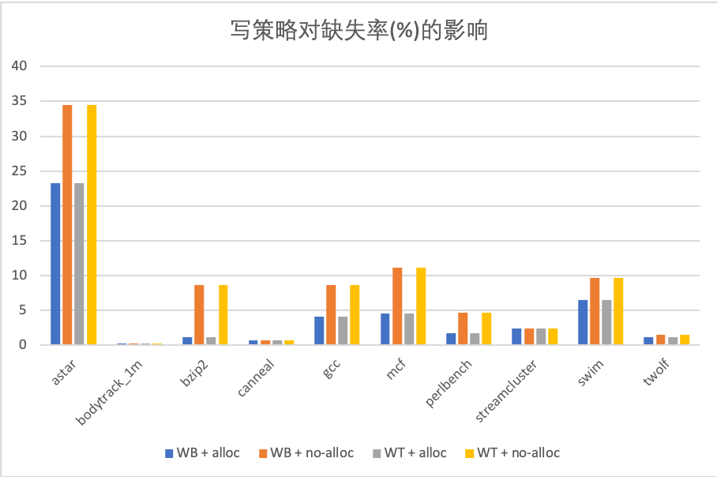

# Cache实验报告

陶天骅 2017010255 计81

## 运行代码

在`code`文件夹中，有三个源文件

```bash
main.cpp
Cache.hpp
Cache.cpp
```

一个`makefile`文件，运行

```bash
make
```

编译出可执行文件`trace`，运行

```bash
./trace
```

将分析`data/trace/`中全部10个trace文件，其中每个文件会用17种Cache设置（在main.cpp中设置）各分析一遍，每一遍会打印相关结果到标准输出。

输出会类似如下

```bash
******************  astar.trace  ******************
Block size: 8
Cache line meta: 49 bits (tag=47 valid=1 dirty=1)
Write policy: write-back + write-allocate
Associative: direct
Replacement: LRU (0 meta bits)
Miss count: 117324 (30716 read + 86608 write)
Hit count: 384144 (259050 read + 125094 write)
Total access count: 501468
Cache miss rate: 23.3961%

Block size: 32
Cache line meta: 49 bits (tag=47 valid=1 dirty=1)
Write policy: write-back + write-allocate
Associative: direct
Replacement: LRU (0 meta bits)
Miss count: 49333 (10790 read + 38543 write)
Hit count: 452135 (278976 read + 173159 write)
Total access count: 501468
Cache miss rate: 9.83772%

... more ...
************************************************************

******************  bodytrack_1m.trace  ******************
Block size: 8
... more ...
```

如果输出太多，可以运行

```bash
./trace > summary
```

另外还会生成10个类似`*.trace.log`的文件，其中记录要求的访问Hit or Miss 的log.

为了保证程序正常运行，需要在`trace`文件所在目录下有`data/trace/*.trace`文件。

`trace.log`和`output/`分别是我之前运行的summary和log结果。

由于全相联和LRU配合使用时，需要操作比较多，时间较长，可能这一项需要运行10秒。其他项比较快。

## 程序实现

### main.cpp

定义了各种Cache配置，如下

```c++
Option options[] = {
    // {blockSize, allocate, writeBack, associative, replacement}
    {8, true, true, direct, lru},
    {32, true, true, direct, lru},
    {64, true, true, direct, lru},
    {8, true, true, full, lru},
    {32, true, true, full, lru},
    {64, true, true, full, lru},
    {8, true, true, way4, lru},
    {32, true, true, way4, lru},
    {64, true, true, way4, lru},
    {8, true, true, way8, lru},
    {32, true, true, way8, lru},
    {64, true, true, way8, lru},

    //        { 8,true,  true,way8, lru},
    {8, true, true, way8, randomReplace},
    {8, true, true, way8, binaryTree},

    //        { 8, true,  true,way8, lru},
    {8, false, true, way8, lru},
    {8, true, false, way8, lru},
    {8, false, false, way8, lru},
};
```

读入文件，逐个运行。

### Cache.hpp & Cache.cpp

#### class Cache

cache的管理类，有`run()`方法。

#### struct CacheLineMeta

每个对象保存一个block的meta数据，包括tag，valid，dirty，不包括替换算法用到的meta数据

可能类似

```bash
Cache line meta: 49 bits (tag=47 valid=1 dirty=1)
```

尽量使用少的字节数，如使用49 bits，则实际为7 bytes。

#### struct BinaryTree

如果使用二叉树近似LRU，每个对象保存需要的meta信息。

尽量使用少的字节数，4-way时，使用3 bits，8-way时，使用7 bits，实际分配都为1 byte。

输出类似

```bash
Replacement: Binary tree ( 7 meta bits )
```

`access(local_block_id)`方法：根据访问id，更新meta信息

#### struct lruStack

如果使用LRU，每个对象保存使用堆栈法需要的meta信息。

如8-way，有8个stack frame，每个3 bits，共24 bits，使用3 bytes存储

输出类似

```bash
Replacement: LRU (24 meta bits)
```

在直接映射时，设置替换算法可能为LRU，但实际没有使用到，显示 0 meta bits。

## 缺失率分析

注：对于只有地址，没有r/w的内容，当作全部是read操作。

### Cache布局的影响

在固定替换策略（LRU），固定写策略（写分配+写回）的前提下，尝试不同的 Cache 布局。

| Option | 块大小 Byte | 写分配   | 替换算法 | 写策略 | 写分配 | Meta bits (tag+valid+dirty) |
| ------ | ----------- | -------- | -------- | ------ | ------ | --------------------------- |
| 1      | 8           | 直接映射 | LRU      | 写回   | 写分配 | 49=47+1+1                   |
| 2      | 32          | 直接映射 | LRU      | 写回   | 写分配 | 49=47+1+1                   |
| 3      | 64          | 直接映射 | LRU      | 写回   | 写分配 | 49=47+1+1                   |
| 4      | 8           | 全相联   | LRU      | 写回   | 写分配 | 63=61+1+1                   |
| 5      | 32          | 全相联   | LRU      | 写回   | 写分配 | 61=59+1+1                   |
| 6      | 64          | 全相联   | LRU      | 写回   | 写分配 | 60=58+1+1                   |
| 7      | 8           | 4-way    | LRU      | 写回   | 写分配 | 51=49+1+1                   |
| 8      | 32          | 4-way    | LRU      | 写回   | 写分配 | 51=49+1+1                   |
| 9      | 64          | 4-way    | LRU      | 写回   | 写分配 | 51=49+1+1                   |
| 10     | 8           | 8-way    | LRU      | 写回   | 写分配 | 52=50+1+1                   |
| 11     | 32          | 8-way    | LRU      | 写回   | 写分配 | 52=50+1+1                   |
| 12     | 64          | 8-way    | LRU      | 写回   | 写分配 | 52=50+1+1                   |

对于12种情况下的全数据测试结果如下。



看出astar的缺失率最高，其他都对cache相对友好。

抽取其中一部分，分析相联度影响。

| 文件          | 直接映射 | 全相联   | 4路      | 8路      |
| ------------- | -------- | -------- | -------- | -------- |
| astar         | 5.26813  | 4.96702  | 5.00989  | 5.00012  |
| bodytrack_1m  | 0.254692 | 0.248153 | 0.248153 | 0.248153 |
| bzip2         | 1.58967  | 0.15445  | 0.15445  | 0.15445  |
| canneal       | 1.07284  | 0.764958 | 0.763136 | 0.764412 |
| gcc           | 0.849165 | 0.673088 | 0.677936 | 0.675415 |
| mcf           | 1.45952  | 1.08371  | 1.08371  | 1.08371  |
| perlbench     | 1.89401  | 0.387434 | 0.853104 | 0.624506 |
| streamcluster | 4.34199  | 2.05322  | 2.64714  | 2.38197  |
| swim          | 1.22166  | 1.14646  | 1.1491   | 1.14646  |
| twolf         | 0.27132  | 0.19738  | 0.198416 | 0.197588 |

对应图表



总体看，直接映射缺失最高，全相联最低。但是8路相联和全相联几乎没什么差距，考虑到全相联实现更复杂，使用8路相联就有比较好的效果。

选取astar和bzip2，分析块大小的影响。

`astar.trace`:

| 块大小   | 直接映射 | 全相联  | 4路     | 8路     |
| -------- | -------- | ------- | ------- | ------- |
| 8 Bytes  | 23.3961  | 23.2597 | 23.2791 | 23.2848 |
| 32 Bytes | 9.83772  | 9.59403 | 9.62993 | 9.62753 |
| 64 Bytes | 5.26813  | 4.96702 | 5.00989 | 5.00012 |

`bzip.trace`:

| 块大小   | 直接映射 | 全相联   | 4路      | 8路      |
| -------- | -------- | -------- | -------- | -------- |
| 8 Bytes  | 2.06147  | 1.21705  | 1.21705  | 1.21705  |
| 32 Bytes | 1.3311   | 0.306328 | 0.306328 | 0.306328 |
| 64 Bytes | 1.58967  | 0.15445  | 0.15445  | 0.15445  |







块较大时缺失率更低，因为较大的块一次调入比较多的数据，减少冷启动缺失。但块也不是越大越好，如果过分大，就会使块数很少，每次调入都会清除许多数据，除非访问是极其局部的（比如顺序访问），否则性能不佳。

### 替换策略的影响

在固定 Cache 布局（块大小 8B，8-way 组关联），固定写策略（写分配+写回）的前提 下，尝试不同的 Cache 替换策略。

| 文件          | LRU      | Random   | Binary Tree |
| ------------- | -------- | -------- | ----------- |
| astar         | 23.2848  | 23.2292  | 23.2874     |
| bodytrack_1m  | 0.248153 | 0.248153 | 0.248153    |
| bzip2         | 1.21705  | 1.21705  | 1.21705     |
| canneal       | 0.764412 | 0.83127  | 0.767873    |
| gcc           | 4.09787  | 4.11532  | 4.09011     |
| mcf           | 4.57593  | 4.59267  | 4.57593     |
| perlbench     | 1.79016  | 1.80119  | 1.78326     |
| streamcluster | 2.38197  | 3.00387  | 2.47516     |
| swim          | 6.53676  | 6.57106  | 6.5361      |
| twolf         | 1.14017  | 1.14017  | 1.14017     |

归一化后的结果，以Random为基准。

| 文件          | LRU        | Random | Binary Tree |
| ------------- | ---------- | ------ | ----------- |
| astar         | 1.00239354 | 1      | 1.00250547  |
| bodytrack_1m  | 1          | 1      | 1           |
| bzip2         | 1          | 1      | 1           |
| canneal       | 0.91957126 | 1      | 0.92373477  |
| gcc           | 0.99575975 | 1      | 0.99387411  |
| mcf           | 0.99635506 | 1      | 0.99635506  |
| perlbench     | 0.99387627 | 1      | 0.99004547  |
| streamcluster | 0.79296707 | 1      | 0.82399039  |
| swim          | 0.99478014 | 1      | 0.9946797   |
| twolf         | 1          | 1      | 1           |

对应图表



在这些例子中，LRU不比随机法好很多，一些例子是基本一样的。同时PLRU和LRU也几乎是相同的。考虑到LRU要维护一个栈，在n路时栈中每个元素log2(n) bit，需要 n * log2(n) bit，而PLRU只要n-1个bit，开销小很多，也不用反复下推栈。Random更是不用维护额外数据，性能也不至于差很多。

### 写策略

| 写策略        |          |          |          |          |
| ------------- | -------- | -------- | -------- | -------- |
| 写分配        | Yes      | No       | Yes      | No       |
| 写回          | Yes      | Yes      | No       | No       |
| astar         | 23.2848  | 34.4989  | 23.2848  | 34.4989  |
| bodytrack_1m  | 0.248153 | 0.248153 | 0.248153 | 0.248153 |
| bzip2         | 1.21705  | 8.66993  | 1.21705  | 8.66993  |
| canneal       | 0.764412 | 0.764412 | 0.764412 | 0.764412 |
| gcc           | 4.09787  | 8.66521  | 4.09787  | 8.66521  |
| mcf           | 4.57593  | 11.1469  | 4.57593  | 11.1469  |
| perlbench     | 1.79016  | 4.6634   | 1.79016  | 4.6634   |
| streamcluster | 2.38197  | 2.38197  | 2.38197  | 2.38197  |
| swim          | 6.53676  | 9.61038  | 6.53676  | 9.61038  |
| twolf         | 1.14017  | 1.45084  | 1.14017  | 1.45084  |



其中WB=write back，WT=write through，alloc=写分配，no-alloc=写不分配。

write back和write through对缺失率没有影响，因为它只影响meta中是否含有dirty的一个bit。

而写分配可以降低缺失率，写时调入cache块。

注：对于只有地址，没有r/w的内容，当作全部是read操作。

综合来看，一个比较好的Cache设计是64B blocksize + 8-way + PLRU + write-allocate，性能好，实现也简单。